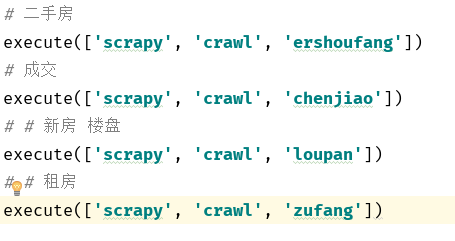
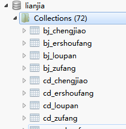

>   auth: zhangminglu
>
>   datetime: 2018-05-05 17:10
>
>   Github: <https://github.com/zhangMingLu>
> 
>  CSDN: <https://blog.csdn.net/zhang_ming_lu>


### 介绍

使用 scrapy  框架和 mongodb 获取 链家网的信息

`fenbushi `文件目录下为通过 Redis 实现分布式实现 爬取链家

>   禁止商用， 仅供学习


### 用途

​	获取链家网所有的二手房信息，和二手房成交信息，以及新房，租房信息，一共可以获取全国24个城市和城市所有的地区的所有信息。


共有四个爬虫，分别爬取 二手房（ershoufang），二手房成交（chengjiao），新房楼盘（loupan），租房（zufang）




### 详情


1.  用时 scrapy 的 Twisted 异步特性，来讲需要的请求放在队列中，等待下载。
2.  通过不同的回调函数进行下载对应的内容
3.  通过不同的城市和页面内容自动生成对应的表保存数据


保存后的数据库示例：




参数：

bj_chengjiao    

-   bj 城市名缩写(北京)
-   chenjiao:  二手房成交信息
-   ershoufang:  二手房信息
-   loupan:  新房房源信息
-   zufang:  房屋出租信息

```python

"""
    北京(bj) 上海(sh) 深圳(sz) 成都(cd) 重庆(cq) 长沙(cs) 大连(dl) 德阳(dy) 广州(gz) 杭州(hz) 
    海口(hk) 合肥(hf) 济南(jn) 昆明(km) 南京(nj) 青岛(qd) 苏州(sz) 石家庄(sjz) 沈阳(sy) 天津(tj)
    太原(ty) 武汉(wh) 厦门(xm) 西安(xa) 郑州(zz)
"""
```


