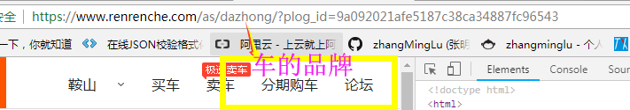
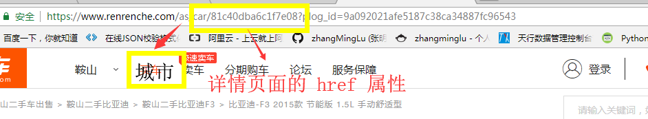
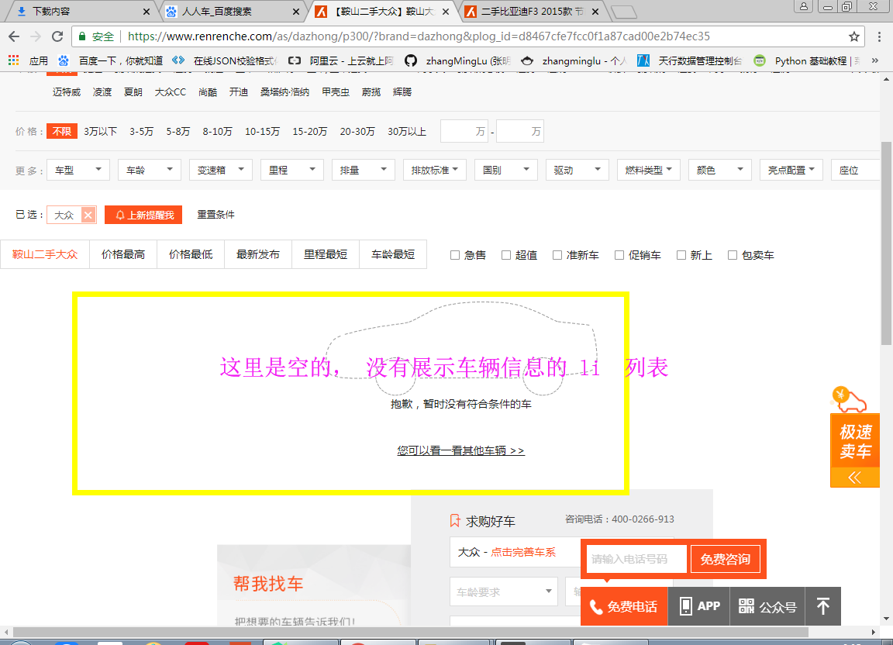
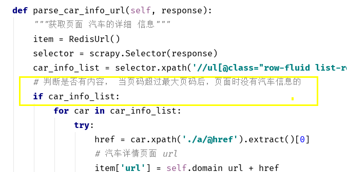
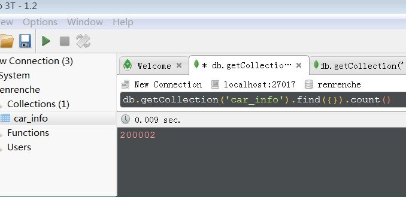
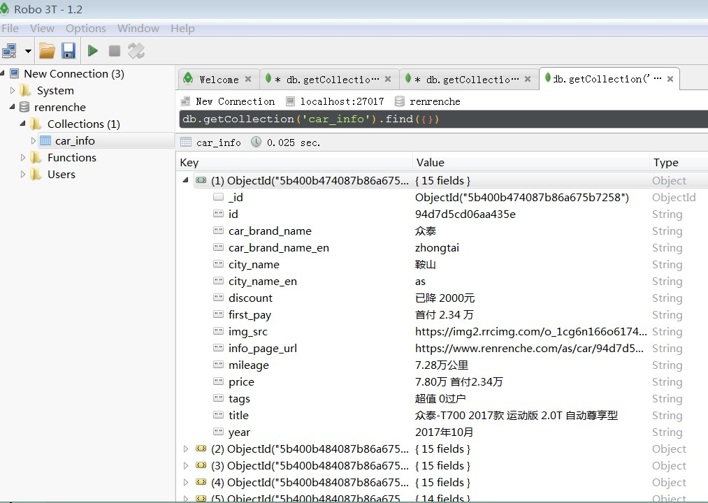

## 爬取人人车的所有二手车信息

>   auth: zhangminglu
>
>   datetime: 2018-03-16 20:45
>
>   Email: 1367000465@qq.com
>
>   Github: https://github.com/zhangMingLu
>
>   CSDN: https://blog.csdn.net/zhang_ming_lu

### 说明

- 这里主要介绍 没有使用分布式的基础版本, 分布式的介绍在[分布式爬取(renrenche_fengbushi)](renrenche_fengbushi/)中

#### 介绍

url    展示 当前城市的某个品牌的所有车

某个车的详情页面 url

获取的页面

当页码超过展示的页码时

#### 代码实现

# 结果展示

下图是从2018.07.07 9:00 -- 07.07 5:00，爬取的数据，未使用分布式

#### 总的条数 ==20万== 条

#### 其中一条数据展示

