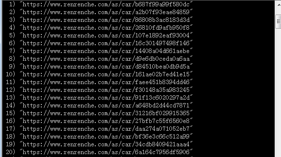
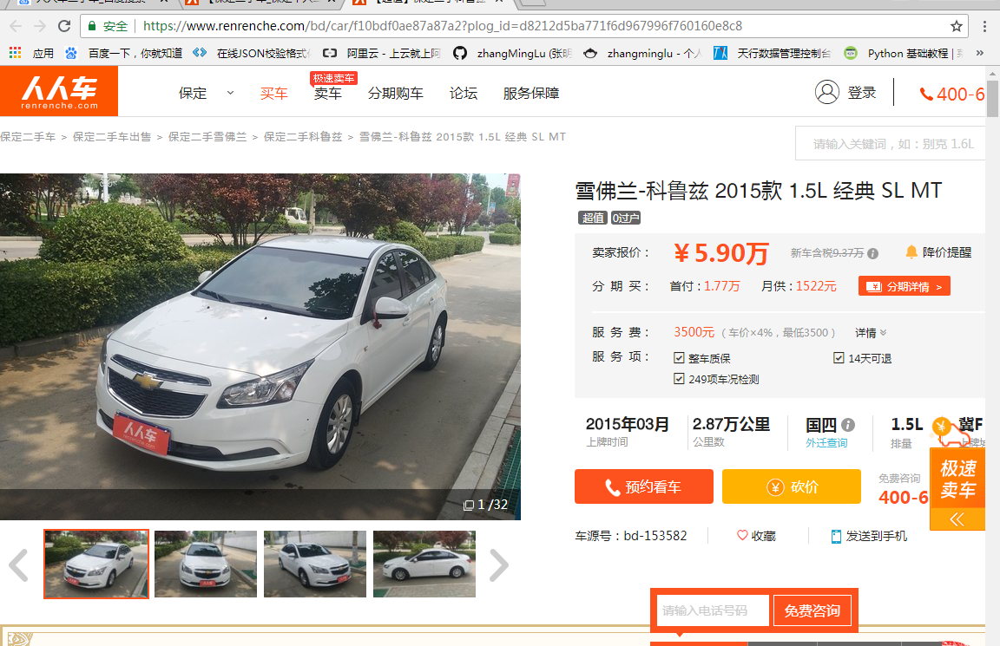
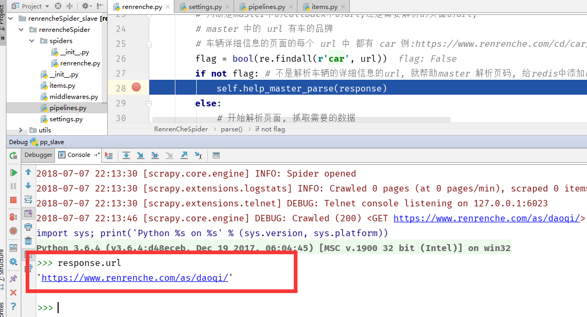
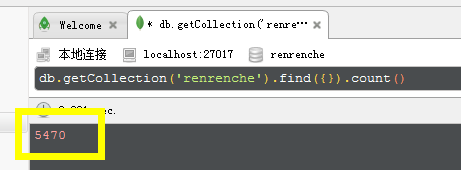
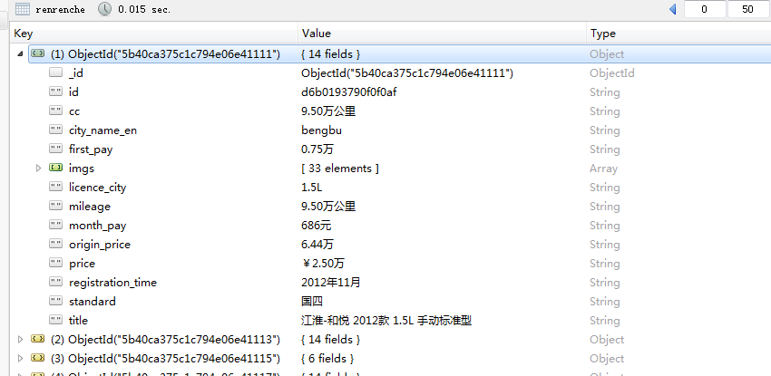
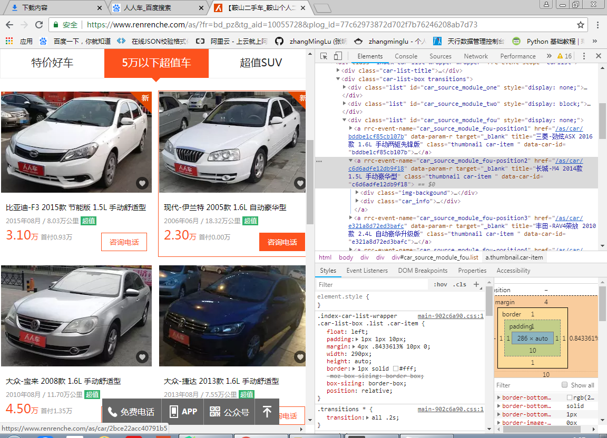
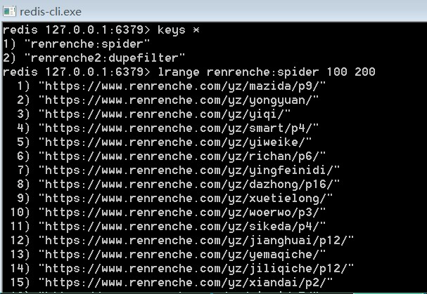
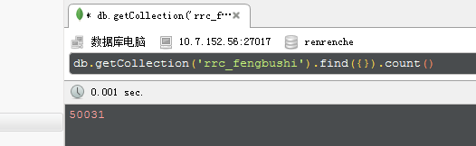
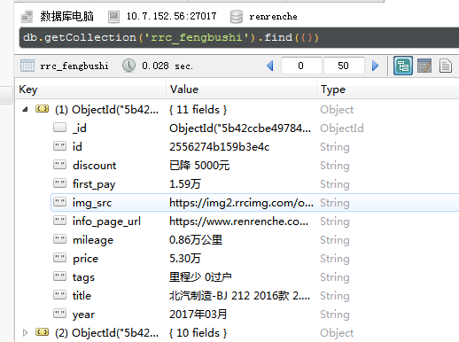

## 分布式爬取


>   auth: zhangminglu
>
>   datetime: 2018-03-16 20:45
>
>   Email: 1367000465@qq.com
>
>   Github: https://github.com/zhangMingLu
>
>   CSDN: https://blog.csdn.net/zhang_ming_lu


### 介绍

版本：

-   [分布式版](/renrenche_fengbushi)： 使用分布式，实现多个 slave 快速稳定爬取数据（解绍信息请读取，分布式版本的[README]()文件）
-   使用 urllib + lxml 解析页面，获取url 入 Redis


>   说明：此版本只做了简单的测试，还有一些漏洞，如 master 的获取 url 代码未优化，只是在 scrapy 原版的基础上做了一些修改。


### 分布式详解

关于spiders

- renrenche.py  采用的是进入子页面进行抓取数据 
- renrenche2.py  直接在当前页面进行抓取数据


### master

`start_requests`

-   urllib + lxml 获取所有的城市和所有的车的品牌

`parse`

-   主要是通过页面的每个 `li` 标签里面的 `a` 标签获取 详情页面的 `href` 属性，传入到 `redis` 中的 待爬取队列中，等待爬取，还还需要翻页。


##### 在 redis中存储的数据展示




### slave

-   主要是负责在redis 数据库中抓取 url 并且进行数据的爬取


数据存储字段

```python

# MongoDB 中的 collection 名称
collection = 'renrenche'
# 城市名  
city_name_en  str
# 车辆信息
# 车 id
id  str
# 出售 标题
title  str
# 标价
price str
# 新车原价
origin_price str
# 首付
first_pay str
# 月供
month_pay str
# 上牌时间
registration_time str
# 公里数
mileage str
# 标准  例：国四
standard str
# 排量
cc str
# 上牌城市
licence_city str
# 图片
imgs list

```


##### 抓取数据页面展示




##### 抓取到的数据示例


###  优化

- 实现 slave 帮助 master进行解析master中的请求

通过打断点可以明显看到, 功能已实现, 优化完成


Redis中存储的数据


断点查看




### 性能测试

**未优化**

(受电脑性能影响)

2018年7月7日 22:25 -- 22:40  使用==3个slave== 共爬取数据 5470 ==条==

#### 数据条数




#### 一条数据展示




### 优化后


#### 抓取的页面




#### redis




#### mongodb

11:00 - 11:30   30分钟   共爬取数据 5万 条




#### 数据字段展示




